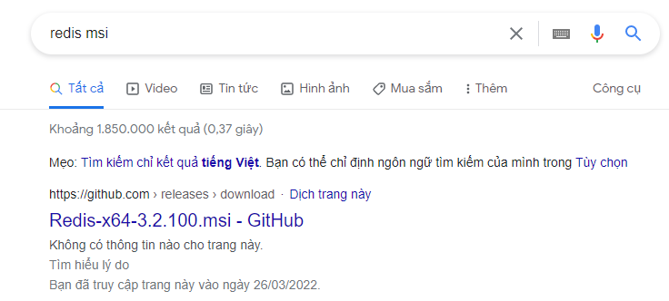
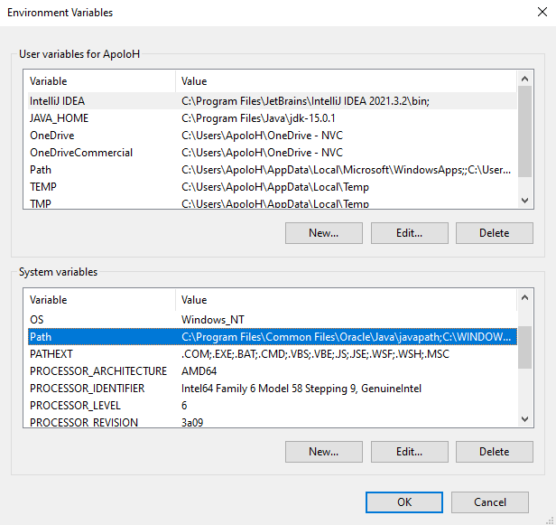
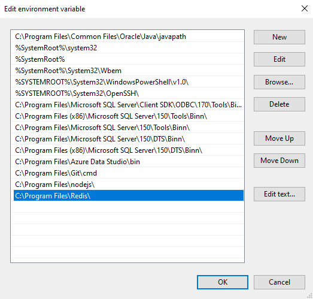

# I. Các đặc điểm của Redis

- Sau khi cài đặt, redis server sẽ mặc định chạy với port 6379
- Dữ liệu được lưu trữ trên bộ nhớ trong ( RAM ), chỉ sử dụng bộ nhớ ngoài để sao lưu và phục hồi dữ liệu
- Dữ liệu trong Redis có thể đặt thời gian hết hạn ( expire )
- Truy cập nhanh
- Lưu trữ dữ liệu theo kiểu key / value, thuận lợi cho việc đọc và ghi
- Có hỗ trợ nhiều loại dữ liệu có cấu trúc phức tạp như List, Set, Sorted Set, Hash, ...

# II. Cài đặt Redis trên Windows






# III. Cài đặt Redis cho Ubuntu

- Mở terminal và gõ lệnh sau

```
sudo apt-get update
sudo apt-get install redis-server
```

# IV. Khởi chạy và tương tác

- Mở terminal và thực hiện lệnh sau để khởi chạy server

```
redis-server
```

- Để tương tác với server

```
redis-cli
```

# V. Các câu lệnh trong Redis

## 1.Redis Key

- Redis key là các lệnh sử dụng để quản lý key trong Redis với cú pháp sau

```
command key_name [value]
```

- Các lệnh thường dùng  
   |STT|Command|Ý nghĩa|
  |------|-----|-----|
  |1 |DEL key| Xóa key nếu nó tồn tại|
  |2| EXISTS key| Kiểm tra key có tồn tại không|
  |3| EXPIRE key n |Đặt expire time cho key sau n giây|
  |4| KEYS pattern| Tìm các key theo pattern|
  |5| PERSIST key| Xóa expire time của key|
  |6| TTL key |Lấy thời gian sống còn lại của key (giây)|
  |7| RENAME key newkey |Đổi tên key sang newkey, nếu newkey đã tồn tại giá trị của nó sẽ bị ghi đè bởi giá trị của key|
  |8| RENAMENX key newkey |Đổi tên key sang newkey nếu newkey chưa tồn tại|
  |9| TYPE key |Lấy loại dữ liệu được lưu trữ bởi key|

## 2. Redis String

- Redis string là lệnh sử dụng để quản lý các key/value trong đó value có giá trị string trong redis
- Ví dụ

```
127.0.0.1:6379> set name hiep
OK
127.0.0.1:6379> get name
"hiep"
```

- Các lệnh thường dùng
  |STT|Command|Ý nghĩa|
  |------|-----|-----|
  |1| SET key value| Đặt giá trị value cho key|
  |2| GET key |Lấy giá trị lưu trữ bởi key|
  |3| GETRANGE key start end |Lấy giá trị lưu trữ bởi key từ (start) đến (end)|
  |4 |GETSET key value |Lấy ra giá trị cũ và đặt giá trị mới cho key|
  |5| MGET key1 key2 ..| Lấy giá trị của nhiều key theo thứ tự|
  |6| SETEX key seconds value| Đặt giá trị và thời gian expire cho key|
  |7| SETNX key value |Đặt giá trị cho key nếu key chưa tồn tại|
  |8| RENAMENX key newkey| Đổi tên key sang newkey nếu newkey chưa tồn tại|
  |9| STRLEN key |Lấy độ dài giá trị lưu trữ bởi key|
  |10| APPEND key value |Thêm vào sau giá trị lưu trữ bởi key là value|
  |11| INCR key |Tăng giá trị lưu trữ của key (số nguyên) 1 đơn vị|
  |12| INCRBY key n |Tăng giá trị lưu trữ của key (số nguyên) n đơn vị|
  |13| DECR key| Giảm giá trị lưu trữ của key (số nguyên) 1 đơn vị|
  |14| DECRBY key n |Giảm giá trị lưu trữ của key (số nguyên) n đơn vị|

## 3 Redis Hash

- Hash là kiểu dữ liệu khá phổ biến, thường được dùng để lưu trữ các object.
- Redis Hash là lệnh sử dụng để quản lý các key/value trong đó value có giá trị là hash
- Ví dụ

```
HSET user:1 name "name 1"
(integer) 1
HGET user:1 name
"name 1"
```

- Các lệnh thường dùng
  |STT|Command|Ý nghĩa|
  |------|-----|-----|
  |1| HSET key field value| Đặt giá trị cho field là value trong hash|
  |2| HGET key field |Lấy giá trị của field trong hash|
  |3| HDEL key field1 field2 ... |Xóa field1, field2 ... trong hash|
  |4| HEXISTS key field |Kiểm tra file có tồn tại trong hash không|
  |5| HGETALL key |Lấy tất cả các field và value của nó trong hash|
  |6| HINCRBY key field n |Tăng giá trị của field (số nguyên) lên n đơn vị|
  |7| HDECRBY key field n |Giảm giá trị của field (số nguyên) lên n đơn vị|
  |8| HINCRBYFLOAT key field f |Tăng giá trị của field (số thực) lên f|
  |9| HDECRBYFLOAT key field n |Giảm giá trị của field (số thực) f|
  |10| HKEYS key |Lấy tất cả các field của hash|
  |11| HVALS key| Lấy tất cả các value của hash|
  |12| HLEN key|Lấy số lượng field của hash|
  |13| HMSET key field1 value1 field2 value2 ... |Đặt giá trị cho các field1 giá trị value1 field2 giá trị value2 ...|
  |14| HMGET key field1 field2 ... |Lấy giá trị của các field1 field2 ...|

## 4. Redis List

- Redis list là lệnh sử dụng để quản lý các key/value trong đó value có giá trị là một list (danh sách). - - List là kiểu dữ liệu khá phổ biến, có 2 kiểu list thường dùng là stack (vào sau ra trước) và queue (vào trước ra trước)

- Ví dụ

```
 LPUSH test value1
 (integer) 1
 LPUSH test value2
 (integer) 2
 LPUSH test value3
 (integer) 3
 LRANGE test 0 10
1) "value1"
2) "value2"
3) "value3"
```

- Các lệnh thường dùng
  |STT|Command|Ý nghĩa|
  |------|-----|-----|
  |1| LINDEX key index |Lấy giá trị từ danh sách (list) ở vị trí index (index bắt đầu từ 0)|
  |2| LLEN key |Lấy số lượng phần tử trong danh sách|
  |3| LPOP key |Lấy phần tử ở đầu danh sách|
  |4| LPUSH key value1 value2 ... |Thêm value1 value2... vào đầu danh sách|
  |5| LRANGE key start stop |Lấy các phần tử trong list từ vị trí start đến vị trí stop|
  |6| LSET key index value |Đặt lại giá trị tại index bằng value|
  |7| RPOP key |Lấy giá trị ở cuối danh sách|
  |8| RPUSH key value1 value2 ... |Thêm phần tử value1 value2 ... vào cuối danh sách|
  |9| LINSERT key BEFORE value1 value2 |Thêm phần tử value2 vào trước phần tử value1 trong danh sách|
  |10| LINSERT key AFTER value1 value2 |Thêm phần tử value2 vào sau phần tử value1 trong danh sách|

## 5 Redis Set

- Redis Set là lệnh sử dụng để quản lý các key/value trong đó value có giá trị là một set (tập hợp)
- Các giá trị trong tập hợp là duy nhất không bị trùng lặp

- Ví dụ

```
redis 127.0.0.1:6379> SADD test value1
(integer) 1
redis 127.0.0.1:6379> SADD test value2
(integer) 1
redis 127.0.0.1:6379> SADD test value3
(integer) 1
redis 127.0.0.1:6379> SADD test value4
(integer) 0
redis 127.0.0.1:6379> SMEMBERS test

1. "value1"
2. "value2"
3. "value3"
```

- Các lệnh thường dùng
  |STT|Command|Ý nghĩa|
  |------|-----|-----|
  |1| SADD key value1 value2 .. |Thêm các giá trị value1 value2 ... vào tập hợp|
  |2| SCARD key |Lấy số lượng phần tử trong tập hợp|
  |3| SMEMBERS key |Lấy các phần tử trong tập hợp|
  |4| SPOP key |Xóa bỏ ngẫu nhiên một phần tử trong tập hợp và trả về giá trị phần tử đó|

## 6 Redis Sorted Set

- Redis sorted set là lệnh sử dụng để quản lý các key/value trong đó value có giá trị là một sorted set (tập hợp được sắp xếp theo điểm/độ ưu tiên từ thấp đến cao)
- Các giá trị trong sorted set là duy nhất không bị trùng lặp
  -Ví dụ

```
redis 127.0.0.1:6379> ZADD test 1 value1
(integer) 1
redis 127.0.0.1:6379> ZADD test 3 value2
(integer) 1
redis 127.0.0.1:6379> ZADD test 2 value3
(integer) 1
redis 127.0.0.1:6379> ZADD test 4 value4
(integer) 0
redis 127.0.0.1:6379> ZADD test 5 value4
(integer) 0
redis 127.0.0.1:6379> ZRANGE test 0 10 WITHSCORES

1) "value1"
2) "1"
3) "value3"
4) "2"
5) "value2"
6) "3"
7) "value4"
8) "5"
```

- Các lệnh thường dùng
  |STT|Command|Ý nghĩa|
  |------|-----|-----|
  |1| ZADD key score1 value1 score2 value2 .. |Thêm các phần tử value1 value2 vào sorted set với độ ưu tiên tương ứng là score1 và score2|
  |2| SCARD key |Lấy số lượng phần tử trong sorted set|
  |3| ZRANGE key start stop |Lấy các phần tử trong tập hợp từ start đến stop|
  |4| ZRANGE key start stop WITHSCORES |Lấy các phần tử trong tập hợp từ start đến stop kèm theo giá trị score của chúng|
  |5| ZSCORE key member |Lấy giá trị score của member|
  |6| ZRANK key member |Lấy vị trí của member trong sorted set|
  |7| ZCOUNT key score1 score2 |Đếm số member có score tương ứng trong đoạn score1 đến score2|

## 7. Redis Transaction

- Redis transaction cho phép một nhóm các lệnh thực hiện theo thứ tự cho đến khi lệnh cuối cùng được thực hiện xong
- Khi này Redis mới cập nhật đồng thời dữ liệu thay đổi bởi nhóm lệnh này
- Redis transaction bắt đầu bằng lệnh MULTI và kết thúc bằng lệnh EXEC

- Ví dụ

```
redis 127.0.0.1:6379> MULTI
OK
redis 127.0.0.1:6379> SET test redis
QUEUED
redis 127.0.0.1:6379> GET test
QUEUED
redis 127.0.0.1:6379> INCR visitors
QUEUED
redis 127.0.0.1:6379> EXEC

1) OK
2) "redis"
3) (integer) 1
```

- Các lệnh thường dùng
  |STT|Command|Ý nghĩa|
  |------|-----|-----|
  |1| MULTI |Đánh dấu bắt đầu khối lệnh transaction|
  |2 |EXEC |Thực hiện khối lệnh|
